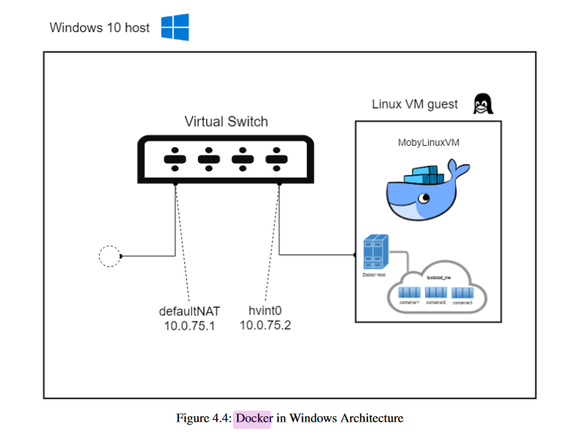

### problem to solve

[x] mongo 无法从非localhost 访问（用）
	默认 mongo.exe 启动时只绑定 localhost

	>WARNING: This server is bound to localhost.
	Remote systems will be unable to connect to this server.
	Start the server with --bind_ip <address> to specify which IP
	addresses it should serve responses from, or with --bind_ip_all to
	bind to all interfaces. If this behavior is desired, start the
	server with --bind_ip 127.0.0.1 to disable this warning.

	启动时需要加参数 
	```
	mongod.exe  --bind_ip 0.0.0.0
	```
	
[x] docker --network host 无法访问app端口（只有linux 下才可以）

[x] docker host 是用哪个 网卡， 为什么 172.17.0.1 无效
	docker 在宿主机中没有docker0网络，只有个nat 接口
	host 的地址是 192.168.65.2（host.docker.internal），当然也可以用外网地址访问host
	172.17.0.1 或者 172.18.0.1 这种地址 会出现在第一个创建的 以host作为网络模式的 容器中，所以在 linux 下访问宿主机的地址，在windows 下只是访问了一个谎称是host模式的container
	参考：https://docs.docker.com/docker-for-windows/networking/

[x] docker nat 是做啥的？（ipconfig 看到的地址是 10.0.75.1/24）
	比如把容器80 映射到 8081，那么我们 curl 10.0.71.1/24:8081 是可以访问的
	但是 host模式的容器 中ifconfig 地址是（10.0.71.2/24），host 模式的容器可以curl 10.0.71.2:8081 ,但是不能 curl 10.0.71.1:8081

[x] 绑得是哪个网卡的80？


[x] metabase 连接数据库入口

[x] mongo 制作数据


### docker network

- docker for  windows 和 linux 下差别非常大

- liunx 的情况最简单

	- 网络类型
	
		- host `--net=host` 或者 `--network host`
			- ifconfig 结果和宿主机一模一样
			
		- bridge
			- 容器 ifconfig 中只有 本地回环网络和 一个bridge上的网卡（即使windows 中也是这样）
			- 宿主机的 在 桥接网络中 的地址一般是 172.17.0.1
			- docker create network test 后， 宿主机会增加一个 172.18.0.1 的设备
			
			
	- 宿主访问容器
	
		- 如果用了host网络，则直接用 localhost 即可访问容器端口 
		- 常见的 端口映射， localhost:port
		- 宿主机也可用 容器在 bridge 网络 172.17.0.0/16 中地址访问容器，比如 172.17.0.2:8080
		
	- 容器间相互访问
	
		- 只有使用同一个bridge的容器才可以相互访问
		- 应该是和安全有关,毕竟在host中是无论如何都可以访问的，host 上也有相应的路由
		- 新建的network的容器，可以用容器名相互访问
		- defaul 的 docker0 中可以用172.17.x.x 的ip访问，但是不能用容器名
	
	- 容器访问宿主
	
		- host 当成 localhost 就可以随便访问
		- bridge 用 172.17.0.1 这种地址，就是宿主机ifconfig 中返回的地址，即可访问
		
- Windows 的情况很郁闷

  有人遇到类似的问题（https://www.iamzs.cn/archives/docker-tutorial.html）
  
  windows的网络结构（https://docs.microsoft.com/en-us/virtualization/windowscontainers/container-networking/architecture）
  
  
  
  
	- 网络类型
		- host
			- 容器 ifconfig 和宿主有很大差别，直接用localhost 无法访问宿主
			- 宿主windows 中，有三个可疑地址，
				- 其中两个（大概这样的地址192.168.41.161/28，172.17.253.113/28）是hyper-v引入的地址
				- 另外一个（大概这样10.0.75.1/24）是docker 的nat 网关地址
			
		- bridge
			- 容器 ifconfig 和 linux下 的情况相同
			- 但是由于宿主系统中没有docker0，新建的bridge 也没有网卡，所以无法直接访问容器
			- 没有网桥，只有一个docker nat，也不知道做啥？只能单向访问？
		
		- docker 似乎维护了两套地址
			- 172.17.*.* 172.18.*.* ...
			- 192.168.65.2，192.168.65.3 (host模式下的容器也会使用这个网络)，其他任何网络模式中的容器都可以访问这个地址
		
	- 宿主访问容器
		- host 无法访问
		- 端口映射, 和linux 一样 - p [host_port]:[port] , curl localhost:port
	
	- 容器间相互访问
		- 和linux 相同 
	
	- 容器访问宿主
		- host.docker.internal(ping host.docker.internal 得到的网址是192.168.65.2)
		- docker.for.win.localhost 也可以
		- host/桥接模式都是一样的地址


### how to run
* metabase
	- docker 
		```
		docker run -d -p 3000:3000 -p 27017:27017 --network host  --name metabase metabase/metabase
		docker run -d -p 3000:3000 -p 27017:27017  --name metabase metabase/metabase
		```
	- java 
		```
		java -jar metabase.jar
		```
	- [metabase 调优](https://www.mayi888.com/archives/58788)
		```
		MB_JETTY_MAXTHREADS=100
		```
	- [数据可视化的开源方案: Superset vs Redash vs Metabase](https://www.cnblogs.com/felixzh/p/9094694.html) 
	
* mongo 
	* docker
		```
		docker run -d -p 27017:27017 -v data:"/data" --name mongo mongo
		```
	* windows exe
		```
		d:/tools
		```	
		```
		mongod.exe  --bind_ip 0.0.0.0
		```
	* roto 3T
		```
		d:/tools
		```
	* create user
		```
		use admin
		db.createUser({user:'test',pwd:'test1234',roles:['readWrite']})
		```
	* mongo client login
		```
		mongo localhost:27017/test -u test -p test1234 --authenticationDatabase admin 
		```
		```
		use admin
		db.auth("test","test1234")
		```
		
	* export/dump
		```
		# db -> 文件夹
		mongodump.exe --db test
		# collections -> console
		mongoexport.exe --db test --collection number
		# collection -> file
		mongoexport.exe --db test --collection number --out test.json
		# collections -> files
		mongoexport.exe --db test --collection number --out test
		```

		